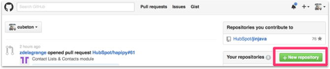
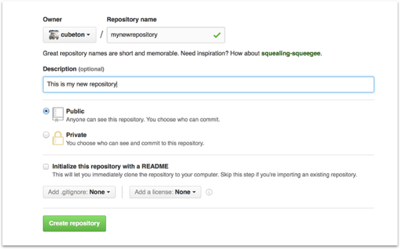

# 步骤六： 在GitHub网页上新建一个仓库

如果只想在本地看到代码，则无需使用网页GitHub。 但是，如果您想团队合作，则可以使用GitHub来协同修改项目代码。

要在GitHub上创建新的仓库，请登录并转到GitHub主页。 您应该看到一个绿色的“ +repository（新仓库）”按钮：




单击按钮后，GitHub将要求您命名您的存储库并提供简短描述：



填写完信息后，按“创建仓库”按钮创建新仓库。

GitHub会询问您是否要从头开始创建新的存储库，或者是否要添加在本地创建的存储库。 在这种情况下，由于我们已经在本地创建了新的存储库，因此我们希望将其推送到GitHub上，因此请遵循“ **....或从命令行推送现有存储库”部分：**

```html
mnelson:myproject mnelson$ git remote add origin https://github.com/cubeton/mynewrepository.git
mnelson:myproject mnelson$ git push -u origin master
Counting objects: 3, done.
Writing objects: 100% (3/3), 263 bytes | 0 bytes/s, done.
Total 3 (delta 0), reused 0 (delta 0)
To https://github.com/cubeton/mynewrepository.git
 * [new branch]      master -> master
Branch master set up to track remote branch master from origin.
```

[addgithub.md](https://gist.github.com/cubeton/3a2616c44e35ca68a6b0#file-addgithub-md)         hosted with ❤ by [GitHub](https://github.com)

```html
mnelson:myproject mnelson$ git remote add origin https://github.com/cubeton/mynewrepository.git
mnelson:myproject mnelson$ git push -u origin master
Counting objects: 3, done.
Writing objects: 100% (3/3), 263 bytes | 0 bytes/s, done.
Total 3 (delta 0), reused 0 (delta 0)
To https://github.com/cubeton/mynewrepository.git
 * [new branch]      master -> master
Branch master set up to track remote branch master from origin.
```

[addgithub.md](https://gist.github.com/cubeton/3a2616c44e35ca68a6b0#file-addgithub-md)         hosted with ❤ by [GitHub](https://github.com/)

（由于您的GitHub用户名和存储库名称不同，因此您需要将第一个命令行中的URL更改为本节中GitHub列出的内容。）