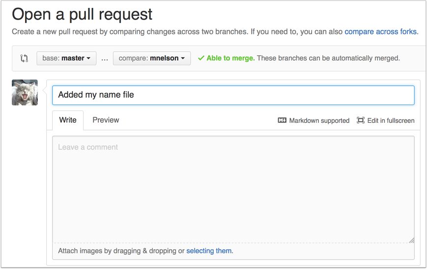
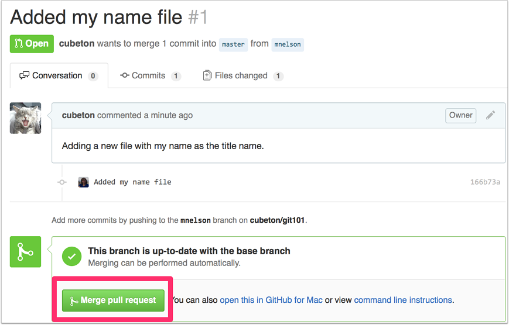

# 步骤八：创建合并请求
合并请求（或PR）是一种提醒仓库所有者您想要更改其代码的命令。仓库所有者在检查代码，并确保代码看起来合适后，可将内容更改后放入主分支。
这是提交PR页之前的样子：

提交PR请求后的样子：

您可能会在底部看到一个绿色的大按钮，上面显示“合并拉取请求”。点击这意味着您将您的更改合并到主分支中。
请注意，此按钮并非总是绿色。在某些情况下，它会是灰色的，这意味着您将面临“合并冲突”。 这是当一个文件中的更改与另一个文件中的更改冲突并且git无法确定要使用哪个版本时。您必须手动输入并让git知道使用的哪个版本。
有时，您将成为repo的共同所有者或唯一所有者，在这种情况下，您可能无需创建PR来合并您的更改。但是，创建一个分支仍是一个好主意，这样您可以保留更完整的更新历史记录并确保在进行更改时始终创建一个新分支。

这是提交合并请求页之前的样子：

 

提交合并请求后的样子：

您可能会在底部看到一个绿色的大按钮，上面显示“合并请求”。点击它意味着您将您的更改合并到主分支中。

请注意，此按钮并非总是绿色。在某些情况下，它会是灰色的，这意味着将出现**“合并冲突”。** 这是当一个文件中的更改与另一个文件中的更改冲突并且git无法确定要使用哪个版本时会出现的情况。您必须手动输入并告诉git使用哪个版本。

有时，您可能是同一个仓库的共同所有者或唯一所有者，在这种情况下，您可能无需创建PR来合并您的更改。但是，创建一个分支仍然是一个好主意，这样您可以保留更完整的更新历史记录并确保在进行更改时始终创建一个新分支。

 
